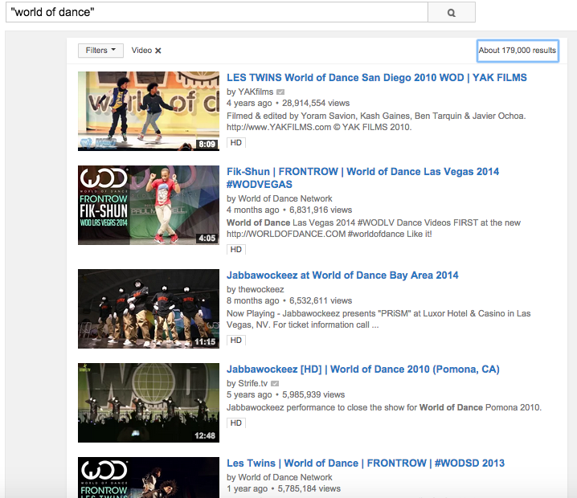

## What is this project for?

The aim of this project is to look at several data fields that one can get from a Youtube video and see whether there is any relationships between the varibles listed below. This is an independent side project that is done by me in order to facilitate my interest in Data Analysis.  

**This project is still in process and this is the initial stage of analysis**

## Data
The data were scrapped from Youtube website. Because of personal interest, I only performed search on Dance Video.  
Here's a screenshot of the search:  
   
  
The data were collected using R. Here are the variables that composed of the dataset:  
```{r include=FALSE}
load(file="DanceComplete.RData")
```
```{r}
colnames(Dance.Complete)
```
  
We start with the basic scatterplot for all variables.
```{r include=FALSE}
#If you don't have ggplot2 package, install it by uncommenting the next line and run it
#install.packages("ggplot2")
library(ggplot2)
```
```{r}
plot(~log(View)+log(Sub)+log(Likes)+log(Dislikes) + log(Duration), data = Dance.Complete, main="Basic Scatterplot")
```
  
From this plot, we know that we should be not be looking at certain variables such as View and Likes and Dislikes due to possible multicollinearity, i.e.e the more people watch a video, the higher probable number of people liking and disliking that video. Therefore, we will need to take note of this as we proceed with analysis.

## View Count and Duration

I am interested in the relationship between view and duration. **My theory is that if a video is long (higher duration), people would be more hesitant to watch it.** Also, another factor that I think worth mentioning is that if a specific channel has more subscribers, then they will be less hesitant to watch a longer video.

### 1) How does Youtube calculate a video's view?
 
First article: [link](http://www.bluefountainmedia.com/blog/how-does-youtube-count-views/)  
It seems like one cannot just reload a page and increase view count. So it either means that it has to be from different IP addresses (or user account, though this might seems less likely due to anonymous viewing), or it has to be from a complete view count. We don't need to get into the technical details of how they do it. We simply need to know what it is.  
Second article: [link](http://www.quora.com/How-does-YouTube-calculate-its-views)  
Quote "amount of video played should be above a threshold percentage of the length of the video" & "viewing the same video repeatedly would only generate 3 to 5 views a day".

At this point, we will just assume that a view is defined as a unique complete view from an IP address. (still a debatable definition but we will stick with this for now)
```{r}
vd <- ggplot(Dance.Complete, aes(y = log(View), x= log(Duration))) + geom_point(aes(color=log(Sub)), position = "jitter") 
vd + geom_abline(aes(intercept = 11.02327, slope = 0.15828), color = "red")
```
  
From the graph, we can see that the points are pretty scattered with the fanning out tendency. This might indicate that as duration increases, number of views might fluctuate more.
```{r}
model3 <- lm(log(Dance.Complete$View) ~ log(Dance.Complete$Duration), data = Dance.Complete, na.action=na.omit)
summary(model3)
plot(model3)
```
```{r include=FALSE}
rstandard(model3) #plenty 
```
  
From the summary, we see that the p-value for Duration is 0.0837. If we choose the p-value to be 0.05, it might say that the duration might not be siginificant *(We might be thinking of changing p-value here if possible?!)*

> R-squared is very low --> model might not be reliable  
> F-stats has p-value > 0.08 --> model might not be accurate

The different graphs of the model all seems to say that there's no relationship between these two variables.  
Looking at standardized residual, we see a lot of points with residuals larger than $\pm 2$ and $\pm 3$.  
We might say that there's no relationship between these two variables, which contradicts my original thoughts.
If we look at the scatter plot again, this time paying attention to the color of each point, we can see that the point with on the top of the graph are usually lighter in color, indicating that the top views are generally from the channels with more subscriber, regardless of duration of the video (which makes sense). The we go down in view count, we see a mix of different color point throughout the duration, which means that for middle range count ($12 - 14$ for log(view) or $162754 - 1202604  views$), the number of subscriber might not matter that much. However, if you want to get to the top range of view, you have to have a substantial number of subscriber first.

## The Relationship Betweek Likes And Upload Month

The number of Like seems to be a more conscious choice on the user side compared to view counts. A person might watch it and constitute to view counts but whether they like the content can be said to be determined by the Like number.  
We plot the following boxplot for View and Likes:  
```{r}
boxplot(log(Dance.Complete$View) ~ months(as.Date(Dance.Complete$Date, origin="1970-01-01")), xlab="Month", ylab="log(View)", col="cadetblue1", main = "Boxplot between Month and log(View)")
```
```{r}
boxplot(log(Dance.Complete$Likes) ~ months(as.Date(Dance.Complete$Date, origin="1970-01-01")), ylab="Month", xlab="log(Likes)", col="aquamarine", las = 2, horizontal = TRUE, main="Boxplot between Month and log(Likes)")
```
  
We will look at Likes and Month uploaded first. It seems like the months with highest median for log(Likes) would be September and December. The longest ranges are seen for June, August and April.    
  
**The skew for each month:**  
Jan |  Skewed right    
Feb | Skewed right    
March     | Symmetric / Skewed left    
April     | Symmetric  
May       | Symmetric    
June      | Skewed left    
July      | Skewed right    
August    | Skewed right    
September | Skewed right    
October   | Symmetric    
November  | Symmetric    
December  | Skewed right    
  
Overall distribution of log(Likes) follows a normal distribution, as expected according to Central Limit Theorem:  
```{r}
h <-hist(log(Dance.Complete$Likes))
xfit<-seq(min(log(Dance.Complete$Likes)),max(log(Dance.Complete$Likes)),length=400) 
yfit<-dnorm(xfit,mean=mean(log(Dance.Complete$Likes)),sd=sd(log(Dance.Complete$Likes))) 
yfit <- yfit*diff(h$mids[1:2])*length(log(Dance.Complete$Likes)) 
lines(xfit, yfit, col="blue", lwd=2)
```
  
A glimpse at the data on dislikes:
```{r}
boxplot(log(Dance.Complete$Dislikes) ~ months(as.Date(Dance.Complete$Date, origin="1970-01-01")), xlab="log(Dislikes)", col="cornsilk", las = 2, horizontal = TRUE, main="Boxplot between Month and log(Dislikes)")
```
  
## The Relationship Between Dislikes and Likes count
  
Basic scatter plotting shows the following:  
```{r}
p <- ggplot(Dance.Complete, aes(log(Dance.Complete$Likes)/log(Dance.Complete$View),log(Dance.Complete$Dislikes)/log(Dance.Complete$View))) + geom_point()
p + geom_abline(aes(intercept=-0.33, slope=1), col="red")
```
  
There seems to be an positive correlation between the percentage of likes/view and dislikes/view. In another word, as more people likes the video, it seems that more people would also dislikes the video. I am not sure about an explanation of this phenomenon. 
  
There are outliers that might be worth looking at as well. We might want to know what distinguish them from other videos.

## Future Aspect To Look At

The next aspect for me to look at would be to apply k-mean clustering in trying to identify trends between different groups in this data frame. I currently have no experience in performing k-mean clustering and would have to learn it from scratch.  
Another aspect that I might look at would be Principal Component Analysis. Currently, I have not touched anything on the description text for a video. My plan is to further break down these description boxes into different components (length, keywords repeated, etc) and see whether there are components contributing to different number in views.  

#### Note
This project has codes that were adapted from [here](https://staesthetic.wordpress.com/2014/06/20/webscraping-youtube-using-r/) in order to scrap the data from Youtube.  
Professor Lopez also helped tremendously with his valuable advices on how to look at data and what approach I should take.

## Contacts
If there is any inquiry, I can be reach at the following:  
anhvu.nguyenlam@gmail.com  
vu.nguyen@skidmore.edu  
My [LinkedIn](https://www.linkedin.com/in/nlavu)
